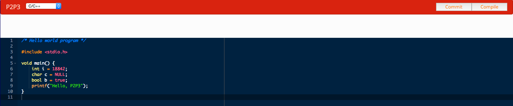
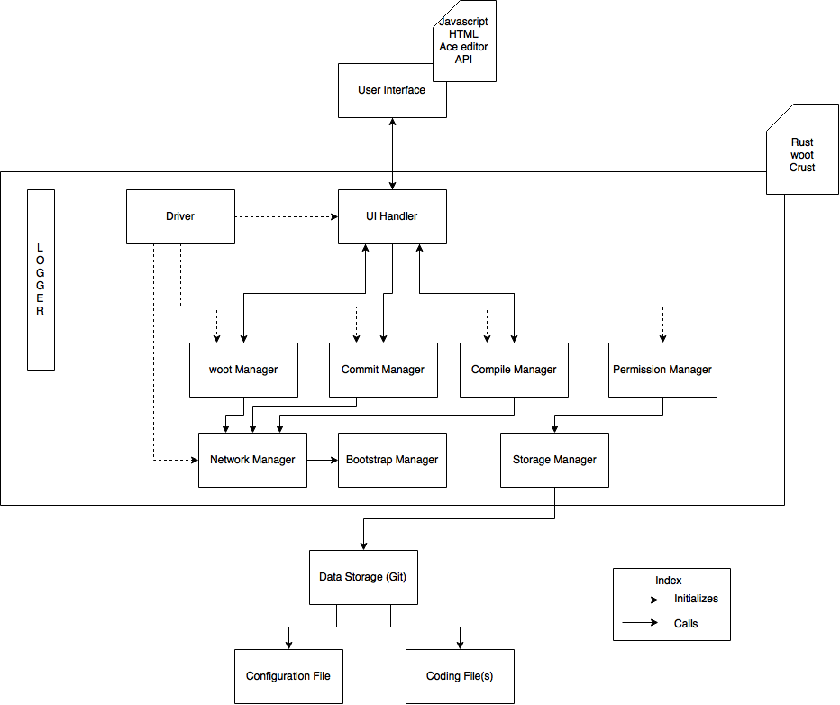
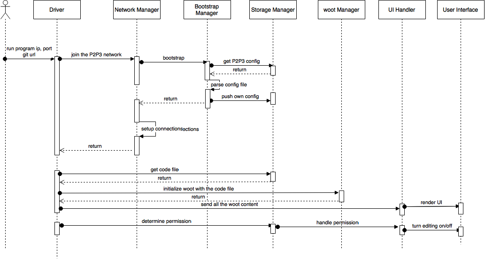
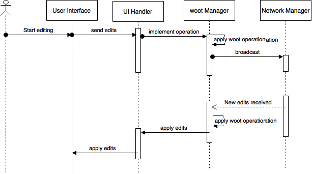
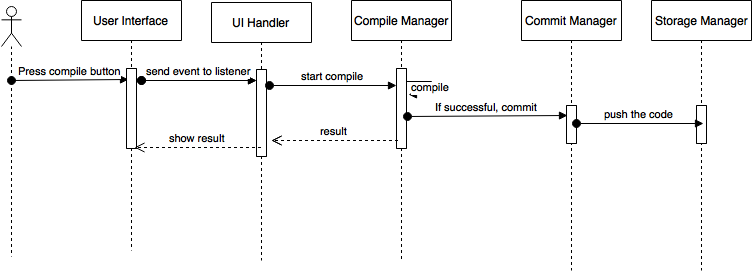
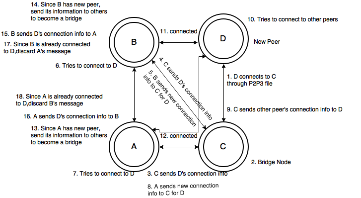
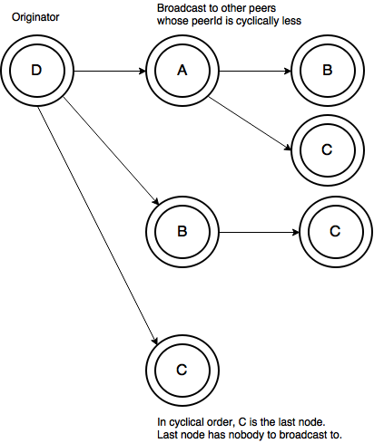

# P2P3

P2P3 is a peer-to-peer pair programming tool written for 18-842 Distributed Systems Final Project in Spring 2016.

## Install for development ##
* Rust version 1.8
* Atom editor

## Install the following packages in Atom: ##
* build
* build-cargo
* cargo-test-runner
* language-rust
* linter
* linter-rust
* racer

## Configure racer ##
Use Cargo to install racer (an auto-complete program for rust) by running "cargo install racer" on the command line or terminal.

Download and extract the rust 1.8 source somewhere. In the racer settings you need to say where the racer executable is and where the rust source root directory is. On windows the racer executable should be in "%USER_HOME%\.cargo\bin\racer.exe", and on unix-like systems it will be "/usr/local/bin/racer". It will also let you know where racer is after cargo finishes installing it.

If we all follow the above we should have a common set of tools to reason about when communicating. Also, it should be more convenient than plain-text editing.

## Run the UI ##
* Install npm. The best way to install npm is to install node. Download the latest version from: https://nodejs.org/en/
* Update npm ```sudo npm install npm -g```
* Go to ../front-end and ```npm install```
* Open ../front-end/index.html in browser.

 

# Introduction

## Background Information

Currently, there are some popular collaborative coding applications such as koding, code.io in the market.  However, most of these applications are running in a client-server model, which means that, there are one or more robust servers running behind the screens in order to support the running of the applications. This structure is often called client-server model, which is also called centralized architecture.

Thus we were interested in forming a different network structure, Peer-to-peer architecture.  Peer-to-peer architecture differs from client-server in that it is decentralized. The role of all the nodes in Peer-to-peer network is the same, or only little different. Peer-to-peer computing or networking is a distributed application architecture that partitions tasks or work loads between peers.  Peers make a portion of their resources, such as processing power, disk storage or network bandwidth, directly available to other network participants, without the need for central coordination by servers or stable hosts.

Another concept we have covered in the project is pair programming. Pair programming is an [agile software development](https://en.wikipedia.org/wiki/Agile_software_development) technique in which two [programmers](https://en.wikipedia.org/wiki/Computer_programmer) work together at one workstation. One programmer, a driver, writes [code](https://en.wikipedia.org/wiki/Source_code) while the other, the observer or navigator, [reviews](https://en.wikipedia.org/wiki/Code_review) each line of code as it is typed in. It allows team members to share problems and solutions quickly making them less likely to have hidden agendas from each other.  And it is estimated that with pair programming,  the resulting code has about 15% fewer defects.  However, typical pair programming requires two programmers sit down side by side, so they can do the coding while communicating with each other.  Thus we thought, if we can build an application which breaks the physical limitation between the programmer, it would be even more efficient to do pair programming.

## Motivation

In the beginning of the Distributed Systems course, groups were made by two people which were assigned randomly. There were many teams whose team members were in different CMU campuses with time zone gap. In this case, they would encounter some difficulties in collaborating with each other. As mentioned above, pair programming is an efficient way to collaborate in coding. In order for two people from different areas coding in pair, they may choose google doc, which is a good tool that provides the real-time editing. That’s not enough though, as for programmers, sometimes they might want the editor provides syntax highlighting and support online compiling. Then, some applications like koding, code.io came to our mind.  At the same time, since we were studying peer-to-peer networks, we came up with an idea to build a application in a peer-to-peer network that provides a real-time editor as well as the support of the online compiling.  Moreover, we want the application also have some mechanism interact with the git, which is a very common tool that every programmer may uses.

## Goals

* Build an application on a Peer-to-peer network, which is constructed of a 2 level hierarchy.

* Use git as data storage.

* Build a file viewer where the user view and modify the file.

* Enable multiple users to edit the same file at the same time.

* Enable all users in the same session to see everyone’s changes in real time.

* Provide support for compilation for some languages (C, C++, Lua, Python, and Ruby.)

* Have a certain level of fault tolerance. 

## Applicability

Nowadays, with the permission of the company, many people would like to work from home, especially those who live far away from their working place. Therefore, it is hard for the team members to do the pair programming in person. Thus they need to find some way to meet their need of pair programming. That is where P2P3 comes into play. With the help of P2P3, people can do the pair programming while still enjoying working from home, in the way that the observer can check the driver’s code in real time, and catch any bugs in the code as soon as possible.

P2P3 also provides the support for multiple access to the same file.  Multiple people can work on the same file concurrently.  Everybody will be able to see other’s cursor’s position, selected ranges of text.  And the changes, such as inserting or deleting contents, will be made immediately to the file viewer.  In this sense, it works like google docs.  But what P2P3 does more than google doc is that it provides the support for compilation, syntax highlighting, committing code to git and other programmer-oriented features.

## View of P2P3

P2P3 is an application that provides the users with a tool that can help them collaborate coding online. P2P3 is built in a Peer-to-peer network architecture. It also provides some interaction mechanism with git. By using P2P3, users can easily open files in their git repository, edit the file, commit and push back to git. On the other hand, git helps P2P3 to do its bootstrap. P2P3 implements this in the way of storing a p2p3.config file in the git repository.

In the front end, there is a file viewer that’s built with Ace editor APIs. The file viewer will be a pane which shows the current file that is being viewed.  The file viewer will show a number of lines and columns of code which the user can change by scrolling vertically or horizontally.  Below navigation is a box that shows compilation results. Besides that the cursor of any remote users in the viewport will be visible, as well as any selected ranges of text.

There are up to 4 kinds of languages the user can choose, and for each P2P3 provides different syntax highlight and compile with different compiler.  The "Commit" button is used to commit the file to the git.  And the “Compile” button compiles the file according to the selected language.  Only the editor can commit and compile the file, viewer can only view the file.  The user who has push rights to the remote git repository passed during initialization can become the editor, and thus gains the permission to commit and compile the files in the git.

If a node edited the file, the changes will propagate to other nodes and the other nodes can see the changes in real time.

User 1’s view:


Other users’ view:



## P2P3 Architecture Design

### Driver

A node runs the program package by specifying its IP Address, connection port and URL to a remote git repository with the username and password for bootstrapping. The driver helps with initialization of all components properly and then begins a thread with an endless loop where it tries to dequeue from an async queue of woot operations. 

### Network Manager

There are several functions that a network manager must perform to ensure the system runs in a distributed fashion. Its foremost responsibility is to establish a fully connected network. After it is done connecting to everyone on the network, it tries to invoke storage manager to push its own config info to the config file. The network manager begins a thread that handles any incoming message from there on. If other nodes have failed, the manager tries to purge that peer’s connection info in config file. For P2P3 project, if an editor fails and there aren't more editors in the network, then the latest changes won’t be pushed to git. In order to add new editors, the node’s public key must be added to the git repo outside realm of P2P3.  If viewers fail, then the system does not need to worry about it. 

### Bootstrap Manager

The git repository will have a configuration file with connection details about other editors which is used by the node to set up socket connection with them through its group communication manager. When an editor node receives connection from a new node, it tries to help the new peer to connect to other peers in the network. During bootstrapping period, if a node is able to successfully push a modified version of configuration file with its connection details to the remote repo, then it is an editor. Thus, since a viewer is not able to push its connection details, other viewers won’t be able to connect to it.  Each editor connects to every other editors, that is, full-connection.  On the other hand, each viewer connects to only one editor.

### UI Handler

UI Handler is P2P3’s mechanism to connect to the front-end, receive changes from it and send back changes. We connect to front-end through a web socket. UI Handler has listener functions to receive changes sent from front-end. It passes them along to appropriate modules. It also has send functions to send changes to the front-end.

### Storage Manager (Permission Manager)

The editing permissions are handled outside of the P2P3 bootstrapping mechanisms. If a node wants to be an editor, it must have git permissions to push to the remote repo. 

There are two main components for data storage: a configuration file and a code file. A configuration file must be present at all times to let the nodes know about each other's presence and communication. The configuration file only stores connection details for editors due to git permissions. In order to ensure each new node can connect to P2P3 network, the file is hosted in a remote server and all nodes must know about it before trying to connect. A code file is the file being edited on P2P3 editor and also hosted in the git repo. 

There are two tiers of permission.

1. Editor - Any node that has been granted permission to collaborate on code editing.

2. Viewer - Any node that doesn't have editor privileges and can only view the code. 

The permission manager can learn the node's level of permission either through configuration file if the node’s ip and port is mentioned the node is an editor, or by the node’s attempt to push changes to the git server which if successfully done makes the node an editor. The permission manager communicates the permission to the User Interface via UI Handler which shows and hides interaction options accordingly. 

### woot Manager

woot (without Operation Transformation) is an algorithm that inherently ensures reliable merge of documents. In order to use the code file for woot, each character in the file must be represented in woot format. Whenever a change is made to the editor, it must be broadcasted to all the nodes (editors and viewers) a node is connected to. In order to ensure all nodes receive it, P2P3 will use reliable multicast. The woot Manager receives any woot operations sent by other nodes; applies to the code file and sends change deltas to user interface. If code change is made in the UI, woot manager is notified so that it can send it out to other nodes via network manager.

### Logger

While woot resolution doesn't require timestamps, timestamps are still needed to ensure a couple of things. Before merging git changes, a node must ensure that they are not merging any stale code and thus needs all nodes' consensus before merge. The nodes can compare the timestamp they received from the merging node and send acknowledgements.

### Compile Manager

The compile manager is responsible for selecting the appropriate compiler and running the code, as well as merging the code if everyone has the latest version. In order to merge the right file, it invokes commit manager.

### Commit Manager

The commit manager is invoked if (a) the node has detected a failure of other nodes and the node has permission to commit to the git repository it is reading file from, or (b) the editor decides to compile their code. In either case, the latest changes to the code must be committed and merged to the master branch in git repo so that the changes are saved if all nodes go down and a new node wants to start with what was previously done. The commit manager discards any compiler generated binary files.



## Interaction Design

### Join P2P3

The use case begins when user runs the program package by providing an ip, port, remote git repository url, username and password to the git repo. The driver initializes network manager. Network manager gets the bootstrap manager to check for configuration file from data storage, parse it. Bootstrap manager also tries to push the nodes’ config to p2p3 config file. Once bootstrap manager is done, network manager sends requests to other nodes. Once a fully connected network is established. Network manager spawns a thread to handle network requests. In the meanwhile, the driver asks storage manager to download code file from the git repo. Once the driver receives file contents, it invokes woot manager to initialize itself. When it is done, it sends contents from woot manager to the UI Handler to propagate it to the UI. The driver will call storage manager to try to push code. If it is successful, then it updates permission manager that the node is an editor and notifies User Interface to show editing options accordingly. 

# 

### Edit coalescing

The use case begins when an editor starts editing the code. The change deltas are communicated from the user interface to UI handler, which in turn calls the woot manager. The woot manager uses network manager to communicate to other nodes. When network manager receives changes from other nodes that pertains to woot operation and if it isn’t a duplicate, it adds the message to woot manager’s queue. There is a thread running that continually waits for something to arrive on woot manager’s queue. When woot applies them, it invokes UI handler to propagate the changes to front-end.

 

### Compiling code

The use case begins when user wants to compile the code. The compile manager is invoked which determines the type of compiler it has to run and runs it. If there are any errors, it notifies the user through User Interface. Else, it asks commit manager to merge only the code file and UI handler to show result on the UI.



## Testing by using AWS

Since we use crust, which contains a beacon system for finding nodes on a local machine, which means that crust will automatically connect to the nodes in the same machine which was created by other process.  It is bad for the testing in that we don’t know whether the connection was set up by the crust itself or by reading the config file in the way that we want it to be.  Thus we launched EC2 instance on AWS in order to get rid of the influence of this local automatic connecting mechanism.

Since the application doesn’t have huge demand for CPU, memory and network, and in order to save the budget, we launched 4 t2.micro instances, which were quite enough for our testing purpose.  By allowing the port number we defined in P2P3, we successfully connected to certain nodes by cloning the git repository and read the config file in it.  That’s a proof that our application can work in the Internet.

# Distributed System Challenges

## Configuration

The git repository passed during initialization of the program must contain a bootstrapping file (p2p3 extension). The file represents Crust network configuration i.e. it lists all the TCP acceptors in the network. When a node tries to join P2P3 network, it gets the first TCP acceptor in the list and establishes socket connection with it. The newly connected node now becomes a bridge for the node to establish connection with others. In a Crust environment, the first connection can be easily established with the node’s ip and port. However, for every subsequent connections, a new connection info must be created to establish connection with a new node, passed to that node and call connect function in Crust. This is where bridge node comes in - to get connection info on behalf of the new node from other nodes in the network and pass the new node’s connection info to peers already in the network. When other nodes in the network receive new node’s connection info, they send a new connection info generated for the new peer to the bridge node and initiate connection. When new node receives other peer’s connection info via bridge node, it also tries to connect to the peer. When there are connect requests from both ends, Crust establishes socket connection and notifies each side with New Peer event. Upon that, the node broadcasts new node’s information to other peers. It is possible to have multiple bridges for a new peer. The new node also eventually adds its tcp socket information in p2p3 file.

## 

During bootstrapping period, if a node is able to successfully push a modified version of configuration file with its connection details to the remote repo, then it is an editor. Thus, since a viewer is not able to push its connection details, other viewers won’t be able to connect to it. The editing permissions are handled outside of the P2P3 bootstrapping mechanisms. If a node wants to be an editor, it must have git permissions to push to the remote repo.

## Consensus

Currently, we do not have paxos algorithm fully implemented but our goal was for the nodes to come to consensus mutually to commit to git repo of the code file so not all the peers commit at the same time. Whenever a user invoked commit action through UI, it becomes a leader and asks if all nodes are ready to commit. A node is ready to commit if their user had requested to commit or there aren’t any new edits happening. 

## Consistency

Consistency is extremely important for our project since the users need to see each other’s updates real-time. To be able to pair-program comfortably, the users need to not only able to see the updates but require the editor to merge their changes in times of conflicts in the edits.

We use Without Operational Transform (woot) to achieve this consistency. This algorithm is particularly adapted in very large peer-to-peer networks to be able to ensure intention consistency in a simpler manner without having to perform Operational Transform.

Intention Preservation, as defined in the woot research report, ensures that the effect of executing any operation, O, at remote site achieves the same effect in such a way that two different actions like (a) executing O when it was generated and (b) execution effects of concurrent operations do not interfere. Thus the changes all converge to the same text.

## Fault Tolerance

It is crucial to detect when a node goes down. Crust library allows us to detect a lost peer and in such case, we remove them from the seed list. This prevents anyone else waiting on their response or wasting bandwidth in sending them data. The lost peer can eventually join back the network as any other new peer by grabbing the initial peer list from git server, meanwhile, while it is disconnected, the disconnected peer should not be able to edit the document.

In order to bootstrap, users use the initial peer list from the remote git server whose availability depends on the availability of the git server. This list is updated everytime a new node joins the network so there is no additional load on any particular peer.

It is important for correct functioning of the editor that all users communicate with all actively connected nodes to show changes in real time. Situations such as network partitions are not acceptable as this can result in different documents. P2P3 doesn’t accept any stale updates. Users must communicate with all actively connected nodes to show changes in real time. Each user does not need to be directly connected with all other users, but a path must exist. 

Moreover, the messages sent over the network could be lost or delayed. While we are using TCP connection and the chances of happening that was minuscule, we have handled it by using reliable broadcast. However, we have tried to reduce the number of messages sent by using sending messages to cyclically greater peer ids. Let’s say there are nodes A, B, C and D in the network and D broadcasts to the network. The message is sent to A, B and C. When A receives it, it broadcasts the message again to B and C because in the cyclical order their ids are less. B broadcasts to C and C has nobody to broadcast to.



# Key concepts of Distributed Systems

## Logical Clocks: Woot algorithm

A vector clocks is an array of logical clocks, one clock per site. It is used to detect the happened-before relationship and therefore the concurrency between operation. It causes no problem if the number of sites is fixed and low but if the number of sites grows, the size of the vector clocks is unbounded. Thus, messages exchanged between our nodes will grow as well as the size of local operation. Also, the time efficiency of operation on vectors clocks will decline as vectors clocks grow. Clearly, vectors clocks prevent these algorithms to scale and represent a serious bottleneck for their deployment on P2P networks. This is the reason we use logical clocks in our project for woot operations resolving. 

## Total ordering with Logical clocks

While trying to resolve different woot operations generated across many sites, it is possible to have numerically identical timestamps. We resolve them using total ordering like suggested in Lamport’s historic paper of 1978 about "Time, Clocks, and the ordering of events in Distributed Systems." The paper suggests that total ordering of timestamped messages is possible for a system with logical clocks by taking into account the ids of the nodes at which events occur. If e is an event occurring at process with identifier i, p(i), with local timestamp T(i) , and e is an event occurring at process with identifier j, p(j), with local timestamp T(j), we define the global logical timestamps for these events to be (T(i), i) and (T(j), j). We can conclude (T(i), i) <  (T(j), j) if and only if either T(i) < T(j), or T(i) = T(j) and i < j . While this ordering has not much significance because process identifiers are arbitrary, for woot operation it is incredibly helpful. 

Every woot character has a unique identifier formed with the peerId and logical clock at the time of creation. If a site receives a change that it cannot easily resolve, it can be resolved by using Lamport’s total ordering:

Let a and b be two woot characters with their respective identifiers (peerId(a) , T(a) ) and (peerId(b) , T(b) ). For woot operation, we can thus conclude a < b if and only if peerId(a) < peerId(b), or peerId(a) = peerId(b) and T(a) < T(b).

If total ordering of any woot operation is still not resolved, it is kept in a pool for the node to re-try to resolve it.	

## P2P Networks: Bootstrapping

	We have learnt about three ways to join a peer-to-peer network, broadcasting a request to join a given p2p network, using an initial seed list to find a peer from the required network and lastly using the DNS naming service. In our project we use an initial seed list for bootstrapping with the peer to peer network. After connecting to the first peer, the node from the peer list will help the new node to connect with all other nodes thus giving a fully connected network. We did not require DNS naming service due to use of Crust and the bridging mechanisms we have come up with.

## Internal Concurrency control

P2P3 project is quite complex in the sense that we have created a complex multi-threaded program where different modules access same objects quite often and updates their state. In particular, changes from the front-end can change state of woot manager and messages received in network manager may contain woot operations that woot manager needs to resolve and change its state. We have locked all reads and writes to make sure consistency is maintained across the program. In order to make sure, there isn’t any starvation for reads and writes, they are done in a controlled scope and immediately released. 

	

## Synchronization

We use woot to synchronize the edits of all the peers working on the document. The algorithm reaches a convergence without having to use any mutual exclusion or other complex algorithms. Multiple users can concurrently make edits without losing information because the woot itself assures intention preservation.

## Security

We use the git server’s access control for the access control mechanisms of our project. The user has permissions to access the document if they have permissions to the git repository. The user when they open the editor are allowed to edit the document if they have editor permissions and if they have just reading permissions they will not be able to make any changes in the editor.					

						

## Global resource access

All peers can access the document globally. They can see each other’s edits and lastly, they also can access the initial seed list globally. 

## Timeliness

Even though initial setup of Crust was an uphill task, we eventually found it to be very useful in terms of detecting events in the network almost immediately. Crust has helped us detect following events in a timely fashion that has helped us a lot to support fault tolerance:

1. New Peer (after bridge connection happens)

2. Lost Peer (as soon as the peer leaves the network)

3. Bootstrap connect (the very first connection a peer makes from Crust config file)

4. Bootstrap finished (when bootstrap initiated in (c) ends)

5. Bootstrap accept (when a peer accepts bootstrap request)

6. New Message (receipt of new message from the network)

# Skills Challenge

Our skills challenge is three part. We chose to use a language which none of the members of the team had experience with, the Rust programming language. We used a library which supported secure connections with peer-to-peer features such as nat traversal, Crust. Lastly, we used an algorithm that supported string merging similar to google docs without requiring a dedicated server, woot.

## Rust

Rust is a multi-paradigm systems language. It is similar to a functional language in the sense that it is not object-oriented, supports variable immutability, is strongly-typed, supports first-class functions, supports recursion, and supports pattern matching types. It is a good choice for a systems language because it has strong thread-safety guarantees and memory lifetimes as part of the type system. Also, it boasts zero-cost abstractions which are meant to keep the performance of the code similar to the speed of compiled C or C++. Rust also structures code into modules, so rather than including header files and the like, the compiler includes other modules. This allows circular references between modules. The last feature which we found useful was the package manager and build system, Cargo. It provides a simple way to specify dependencies and include external libraries. Rust is a fully featured language that interested us.

We chose to use rust due to these reasons combined with our team being completely new to the language. We feel that learning to use Rust will add something interesting to our resumes. Also, we found that the documentation and community involvement is thorough enough that we would be able to find the help necessary to solve problems during development. Beyond this, we found library support for network communication, websockets, HTTP servers, serialization, and many more features we thought we may need.

### Our Issues Using Rust

We did not adjust our design for the features available in the language. Our initial designs were based on concepts from object oriented programming. We found that while it is possible to make the behaviors of Rust match object oriented programming languages such as Java or C++, the methods to do so are complex and convoluted.

We were not able to find an IDE with debugging support. We chose to use the Atom editor with extensions for syntax highlighting and code completion in Rust. However, not being able to truly debug the code by setting breakpoints and reading variable values on the fly like in Visual Studio or Eclipse using Java or C++ caused us to spend a very large amount of our development time debugging code using print statements.

We also spent a lot of time debugging errors we would get from compiling certain third-party libraries. One such library linked a prebuilt static library which required an environment variable to be set. This violates the cleanliness of the Cargo build system. Rather than including that library in the package, the documentation for the library directs users to go to a link, download the library, place it in a directory, and set an environment variable. Because this library was a dependency of a dependency, we had trouble finding which of our included packages caused the cryptic build message which indicated that a library was not found and static linking failed.

We also spent an inordinate amount of time squashing compile errors caused by various aspects of the type system. We have learned now how most of semantics work for Rust types, but while learning we had significant difficulties. We had faced errors from not being able to borrow an already borrowed variable, not being able to mutate an immutable reference, not being able to pass an unsized type, and several other errors that are cryptic to people first learning the language.

## Crust

We chose Crust due to its encryption mechanisms and inherent P2P features like UDP rendezvous and bootstrapping. While we didn’t know this at the time of picking it up, we found that it also notified peers about some key events like lost peer, new peer, and new message immediately. However, it was still very challenging due to its connection semantics which was very different than any standard language we had worked with. In order to establish socket connections, a peer needed a new connection info per connection. Except for the first bootstrap connection, two peers had to have connection info about each other to even wait on connection to happen. 

### Our Issues Using Crust

Given that Crust documentation was out of date and inadequate, we had to do a lot of figuring out on our own to fully understand how it worked. We found that during bootstrap phase, crust allows node to connect to only one peer. We came up with our own mechanism to connect to other nodes via that peer.

## woot - Without Operational Transform

When we set out to find good ways of coalescing text changes we came across two conflicting algorithms Operational Transform and without Operational Transform. Both algorithms try to solve for coalescing problems of changes generated in different nodes and maintain consistency across different nodes. The key difference lies in how the changes are resolved. Operational Transform involves the algorithm trying to figure out the happened before relationship among the changes generated by the site and changes sent by others. For example, if node A tried to delete character at position 1 and node B tried to insert character at position 2, at node A since character was deleted at position one, the insert operation from B needs to be adjusted to position 1. Node A needs to take care of these calculations which makes it difficult to preserve the author’s intention. 


woot on the other hand was designed with intention preservation in mind. Every character in it is represented by a 5-tuple structure with previous character id and next character id. No character is deleted;  they are simply turned on or off. This makes it easier to coalesce changes.

### Our Issues Using woot

We mainly struggled with implementing the algorithm with Rust and its steep requirement of taking in only one character change at a time. We realized that it is not as scalable as we want it to be and later in the project found other mechanisms like logoot to resolve lines of changes instead of character at time. 

Overall, these tools have their own merits and demerits. For future teams, our suggestion would be pick them up with caution. 

# Project Management

## Team organization

Our initial goal was to pair program as often as we could and work concurrently at the same time to improve accountability. While we started out doing these things, we had a slump in between, but eventually picked up. Even though we did begin project with pair programming, the sessions did not go very smoothly as we did not have much knowledge about language semantics to write code together. Despite a slump in the middle, when we were trying to figure out However, the final two weeks, we worked in pairs and had many meetings to work on the project concurrently and ask for help when needed. 

## Methodologies

We wanted to use Agile methodology to organize the project and did setup an agile board in Trello. We went through a planning exercise where we added tasks for minimal viable version of P2P3, assigned them and estimated the number of hours we were going to spend on it. However, due to steep learning curve of Rust, we had many hurdles in meeting the sprint deadline. We soon decided we should continue working on tasks we had undertaken. Eventually, we started keeping a list of tasks that needs to get done and re-assign people as needed. While a well-defined software development methodology would have been helpful, due to looming deadline and hardship with the languages we picked, we decided to continue along without picking a methodology.

## Work Breakdown / Task List

* Learn Rust [Pragya, Roshani, Matt, Xing]

* Front-end development

    * Setup UI editor [Pragya]

    * ACE editor APIs integration with UI [Roshani]

* Driver

    * Create a package that needs ip, port and git url to run [Pragya, Roshani]

    * Make it run html, js and bring the editor up [Matt]

* UI Handler

    * Create listener threads for UI [Matt, Roshani]

    * Create sender threads for UI [Pragya, Matt]

    * UI Handler Tests [Matt]

* Bootstrap Manager

    * Connect to the given git repo and download configuration file [Xing]

    * Parse configuration file [Xing]

    * Push node’s configuration to git repo and update permission if rejected from the server [Xing]

* Permission Manager

    * Keep track of permission level of the node [Roshani]

    * Create a function to query permission level [Roshani]

* Woot algorithm implementation

    * Create Character struct that supports 5-tuple required to represent each character [Pragya]

    * Convert a code file to woot Character representation [Pragya]

    * Create insert operation [Pragya]

    * Create delete operation [Pragya]

    * Convert woot operations that can be consumed by the ACE editor [Pragya]

    * Send editor consumable instructions to front-end [Pragya]

    * Unit tests for woot operations [Pragya]

* Network Manager

    * Crust [Matt]

    * Setup fully connected network [Matt, Roshani, Pragya]

    * Unit tests [Matt]

* Group Communication Manager

    * Broadcast [Matt, Xing]

    * Connect to git server and handle errors [Roshani]

    * Create listener threads [Matt]

    * Create message sender [Matt, Xing]

* Compile Manager

    * Add all compilers [Matt]

    * Relay execution output to Front-end and peers [Roshani]

* Logger [Xing]

* Test Infrastructure

    * Add APIs for the network testing [Matt, Xing]

    * Setup Git repository [Roshani]

## Schedule and Timeline

### Sprint 1: 3/21 - 4/3 The Minivia

During this phase we attempted to get a minimum viable product started. However, we were not fully able to get to all tasks done in time.

Tasks:

* Learnt Rust

* Started setting up network with Crust

* Basic broadcast working

* Started implementing woot algorithm

* Front-end development: Setup UI editor

* Setup git repository

### Sprint 2: 4/4 - 4/17 The Pollurd

During this phase, we will attempted to add features over the bare minimum. We resolved conflicts that arose during the first phase with our better understanding of Crust and Rust. However, we were still far off from being done. We had many different pieces working but they were not integrated

Tasks:

* Front-end development: ACE editor APIs integration with UI 

* Driver: Create a package that needs ip, port and git url to run 

* UI Handler: Create listener threads for UI

* UI Handler: Create sender threads for UI 

* UI Handler Unit Tests

* Permission Manager: Keep track of permission level of the node

* Create a function to query permission level 

* Woot algorithm implementation with Unit tests

* Network Manager: Integrate with Crust 

* Connect to git server and handle errors

* Add few compilers 

### Sprint 3: 4/18 - 4/25 The Norest

Even though we made rapid progress during this iteration, the integration of all different modules started surfacing bugs up and we had little time left to fight all fires.

Tasks:

* Driver: Make it run html, js and bring the editor up

* Bootstrap Manager: Connect to the given git repo and download configuration file

* Bootstrap Manager: Parse configuration file

* Bootstrap Manager: Push node’s configuration to git repo and update permission if rejected from the server 

* Setup fully connected network 

* Unit tests for Network Manager

* Group Communication Manager: Broadcast 

* Connect to git server and handle errors

* Create listener threads for incoming messages

* Create message sender

* Add all compilers 

* Relay execution output to Front-end and peers

* Logger

## Source Control

For source code control, we used a git repository hosted remotely at Bitbucket. We used master branch as our stable code branch and worked off of several work-in-progress branches before merging to master. Before merging or committing to master branch, we had to make the build succeeds and the unit tests pass.

## Retrospective

In retrospect, while we were not able to meet all of our goals and the integration was not fully done, we still ended up creating a P2P system that has bootstrapping, fully connected network where messages are broadcasted, permissions tied to git repository access, compilation for C, C++, Python, Lua, Woot algorithm implementation, cursor change, and syntax highlighting. This project challenged us to go out of our comfort zones, try a new language and learn frequently through our failures. While we are doleful that we weren’t able to meet all our goals, we are proud of the work we have done, the hard work team has put in and the increased understanding of DS concepts from practical application.

# References

1. Oster *et al.* (2005) *Real time group editors without Operational transformation*, report paper 5580, INRIA - http://www.loria.fr/~oster/pmwiki/pub/papers/OsterRR05a.pdf

2. Oster *et al.* (2006) *Data Consistency for P2P Collaborative Editing*, CSCW'06 - http://hal.archives-ouvertes.fr/docs/00/10/85/23/PDF/OsterCSCW06.pdf

3. Coulouris, George. *Distributed Systems: Concepts and Design.* Boston:Pearson Education, 1988. Print.
